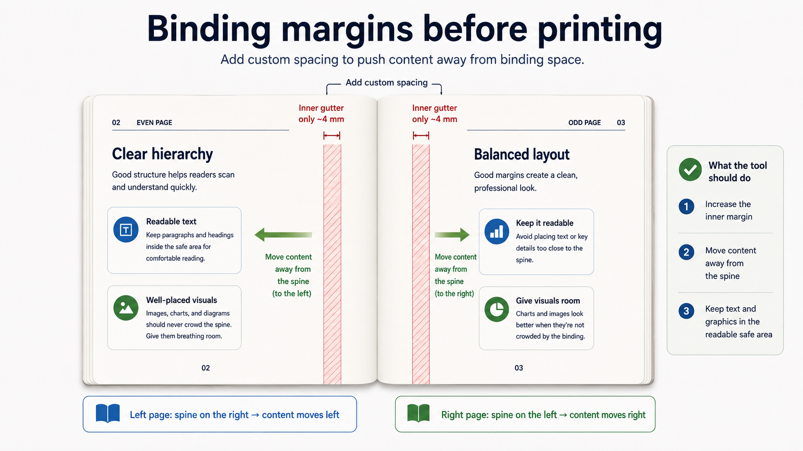
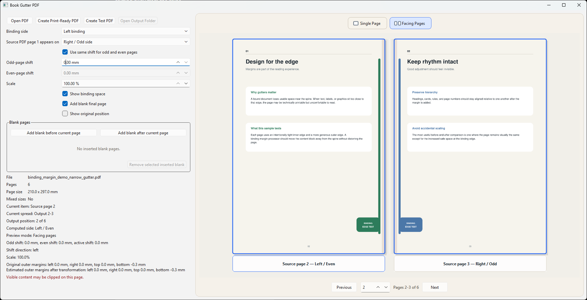
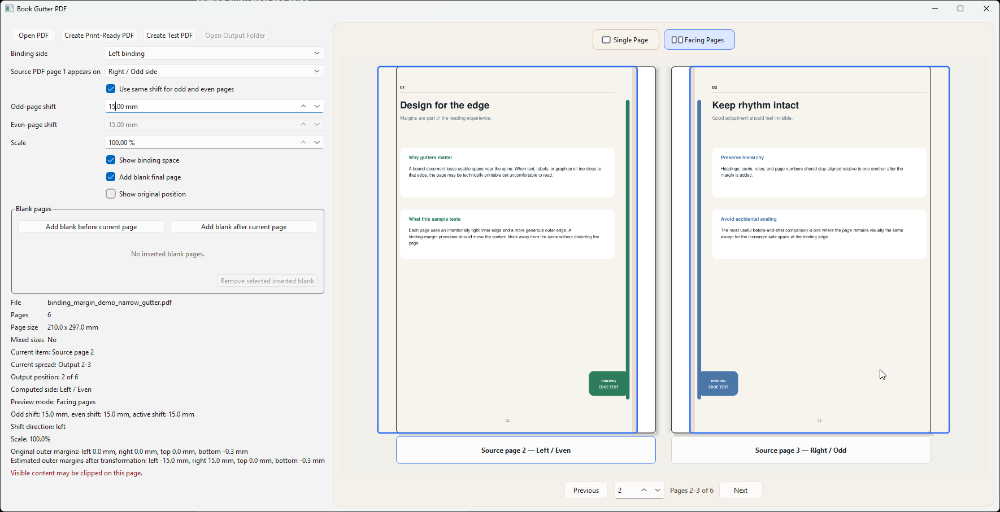

# Binding Margins PDF

<p align="center">
  
</p>

Binding Margins PDF is a Windows desktop utility for adding custom inner binding space to PDFs before printing. It shifts page content away from the spine on alternating odd/even pages while preserving page order and, at 100% scale, the original text size.

It is intended for books, manuals, reports, zines, and other side-bound duplex documents.

This is not booklet-imposition software. It does not rearrange pages into folded signatures or place multiple pages on one sheet.

## Binding margins before printing



The binding margin is added at the inside edge of each page. In facing-page layouts, the left/even page moves left and the right/odd page moves right, creating more usable space near the spine.

## Before and after

### Before — 0 mm binding shift



With no added binding shift, content can sit too close to the inner gutter and become uncomfortable to read after binding.

### After — 15 mm binding shift



After adding a 15 mm inner shift, the content moves away from the spine while the facing-page relationship remains intact.

## What it does

- Independent odd-page and even-page binding shifts
- Linked equal-shift mode
- Left or right binding
- Millimetre-based controls
- 100% scale available to preserve text size
- Facing Pages preview
- Single Page preview
- Binding-space visualization
- Optional original-position overlay
- Intentional blank pages
- Four-page Test PDF
- Full print-ready PDF export
- Mixed page-size support
- Source PDF remains untouched

## How it works

1. Open a PDF.
2. Choose whether source page 1 starts Right/Odd or Left/Even.
3. Choose left or right binding.
4. Set odd/even shifts.
5. Keep scale at 100% initially.
6. Use Facing Pages preview to judge the gutter.
7. Use Single Page for close clipping inspection.
8. Create a Test PDF.
9. Adjust if needed.
10. Create the full print-ready PDF.

For duplex printing, odd/right and even/left pages move in opposite directions. Inserted blank pages are part of the composed output sequence, so they correctly change the side of following pages.

## Facing pages vs duplex sheets

- Facing Pages is a preview of an open bound document.
- It does not reorder the exported PDF.
- Example facing spreads: 2–3, 4–5, 6–7.
- Physical duplex sheet pairs remain 1–2, 3–4, 5–6.

## Installation

### Requirements

- Windows
- Python 3
- PySide6
- PyMuPDF
- NumPy

### First-time setup

```powershell
setup_book_gutter.bat
```

PowerShell alternative:

```powershell
.\setup_book_gutter.ps1
```

The setup scripts create a project-local `.venv`, install `requirements.txt`, and verify the required imports.

### Launch

```powershell
Book Gutter PDF.bat
```

PowerShell alternative:

```powershell
.\launch_book_gutter.ps1
```

The launchers prefer `.venv\Scripts\python.exe`. If the environment is missing, run the first-time setup.

## Quick start

1. Open a PDF.
2. Confirm whether page 1 is Right/Odd or Left/Even.
3. Choose the binding side and set the odd/even shifts.
4. Keep scale at 100% initially.
5. Check the gutter in Facing Pages preview.
6. Create a four-page Test PDF and print a small physical check.
7. Adjust if needed, then create the full print-ready PDF.

## Limitations

- Clipping detection is estimated; physical test printing remains the final check.
- Printer duplex reload direction must be tested separately.
- Unusual annotations, forms, or internal links may not be fully preserved.
- This is not booklet or signature imposition software.
- Windows is the currently tested platform.
- A packaged installer is not currently published.

## Development

```powershell
$env:PYTHONPATH='src'
python -m pytest -q
```

The test suite covers layout, parity, preview, export, and threading behaviour. Source PDFs must never be modified in place.

## Contributing

Issues and pull requests are welcome. Please include reproduction steps, platform and Python version, and run the tests before opening a pull request.

## License

A project license has not yet been selected. Until a license is added, normal copyright restrictions apply.

## Built with

- Python
- PySide6
- PyMuPDF
- pytest
